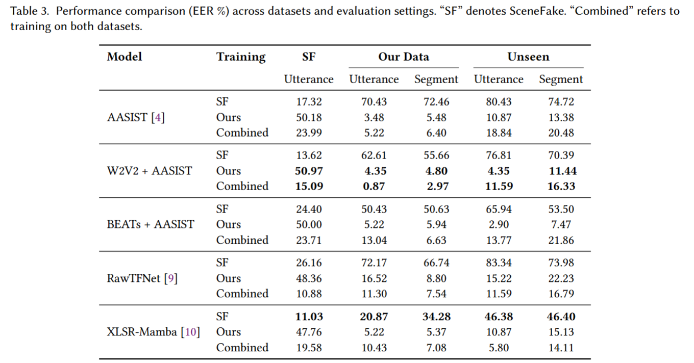

## Real SceneFake

This repository contains baseline implementations for the **Real SceneFake** dataset.

### Evaluated Models

* **AASIST**
* **W2V2 + AASIST**
* **BEATs + AASIST**
* **RawTFNet**
* **XLSR-Mamba**

---

### Experiments:

1. **Generalization Compatibility (XLSR-Mamba)**
   Evaluates how well XLSR-Mamba trained on one dataset generalizes to another.

2. **K-shot Fine-tuning (XLSR-Mamba)**
   Measures performance when adapting the model with limited samples (few-shot setting).

3. **Cross-dataset Generalization**
   Tests robustness when training and testing across different datasets.

---

### Overall Cross-dataset Performance

---
