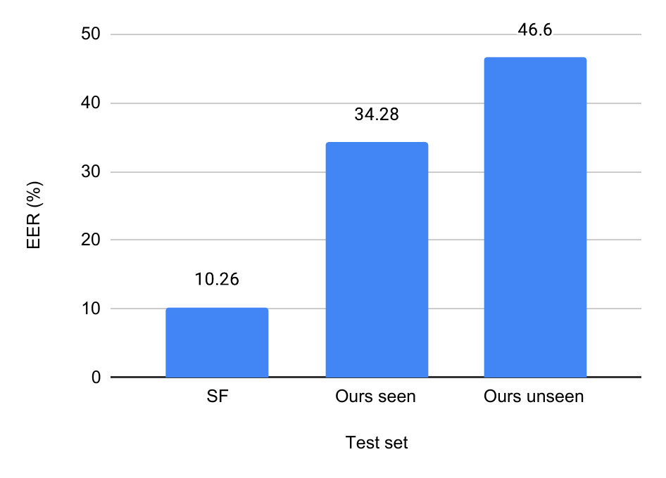

### XLSR-Mamba

Code adapted from:
[https://github.com/swagshaw/XLSR-Mamba.git](https://github.com/swagshaw/XLSR-Mamba.git)

---

The pretrained models are available at: https://huggingface.co/datasets/sinhajiya/Real_SceneFake/tree/main/pretrained_models

### Results

#### Generalization Capability



---

#### Few-shot Fine-tuning (EER %)

| K  | SF (Utt) | Seen (Utt) | Seen (Seg) | Unseen (Utt) | Unseen (Seg) |
| -- | -------: | ---------: | ---------: | -----------: | -----------: |
| 1  |    10.89 |      20.87 |      34.40 |        47.10 |        46.40 |
| 5  |    10.76 |      19.13 |  **25.83** |        29.71 |        33.39 |
| 10 |    14.35 |      21.73 |      24.46 |         6.52 |    **19.65** |

---

#### Cross-dataset Performance (EER %)

| Training |  SF (Utt) | Seen (Utt) | Seen (Seg) | Unseen (Utt) | Unseen (Seg) |
| -------- | --------: | ---------: | ---------: | -----------: | -----------: |
| SF       | **11.03** |  **20.87** |  **34.28** |    **46.38** |    **46.40** |
| Ours     |     47.76 |       5.22 |       5.37 |        10.87 |        15.13 |
| Combined |     19.58 |      10.43 |       7.08 |         5.80 |        14.11 |

---


### Citation

```bibtex
@article{xiao2025xlsr,
  title={XLSR-Mamba: A dual-column bidirectional state space model for spoofing attack detection},
  author={Xiao, Yang and Das, Rohan Kumar},
  journal={IEEE Signal Processing Letters},
  year={2025},
  publisher={IEEE}
}
```
